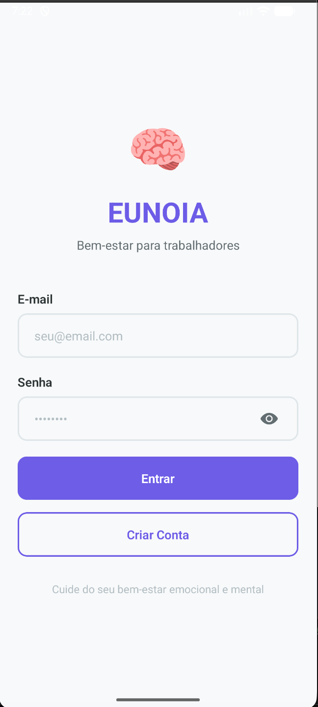
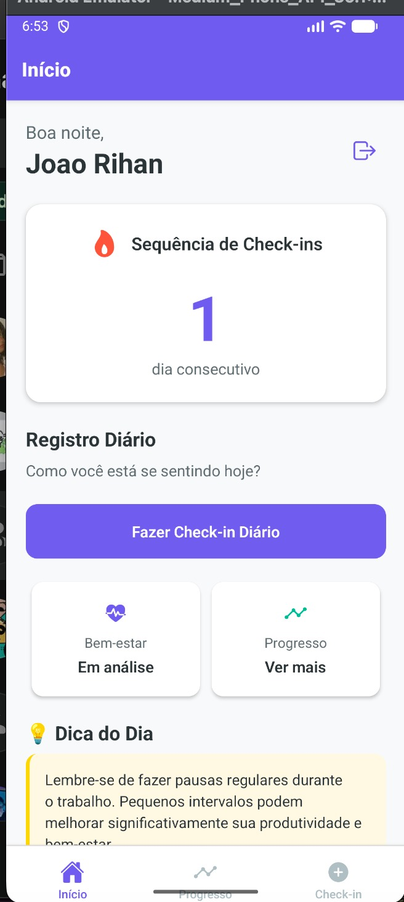
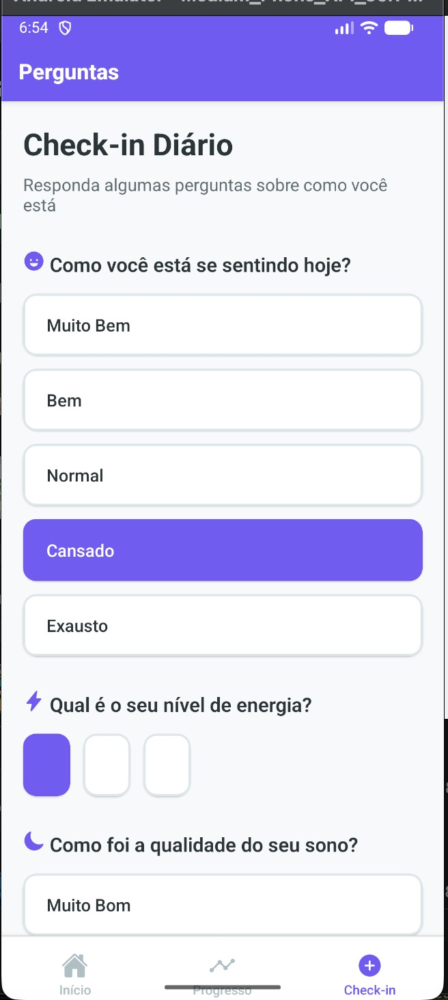
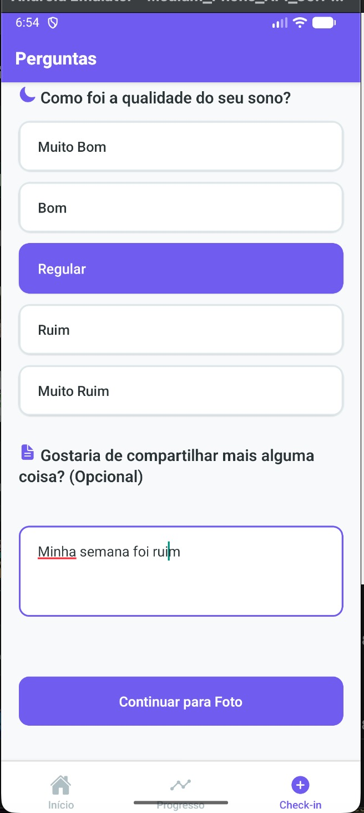
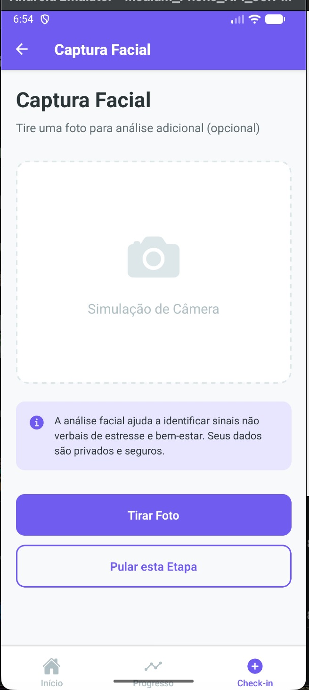
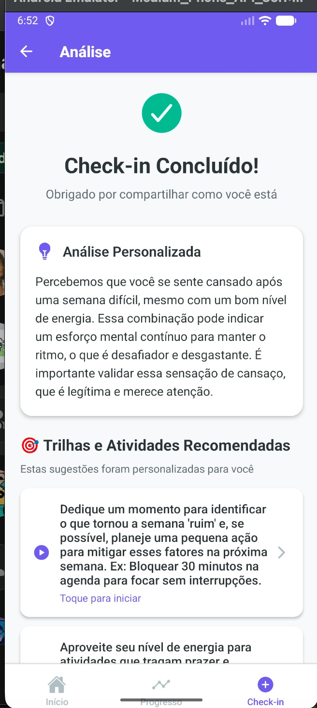
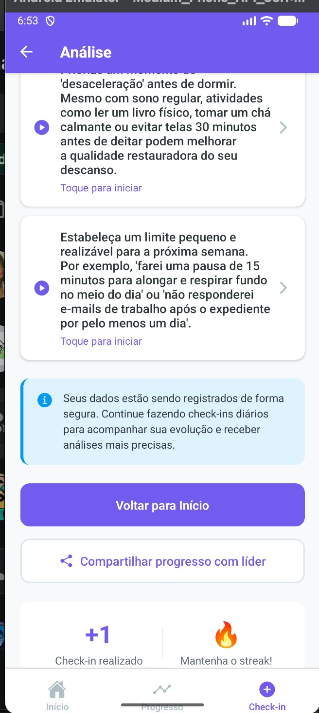
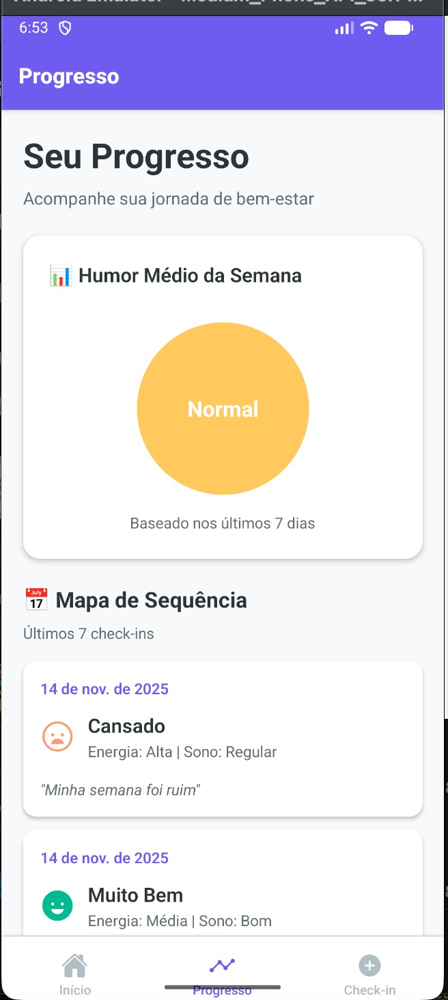

# 🧠 EUNOIA - Worker Well-being App

> **EUNOIA** (εὔνοια): Do grego, significa "bela mente" ou "bem pensar". Um aplicativo mobile para promover o bem-estar emocional dos trabalhadores através de check-ins diários, análise de IA e acompanhamento de progresso.

## 👥 Integrantes da Equipe

| Nome | RM |
|------|-----|
| Rodrigo Fernandes Serafim | RM550816 |
| João Antonio Rihan | RM99656 |
| Letícia Resina | RM98069 |

---

## 📱 Screenshots da Aplicação

<div align="center">

### Tela de Login 


--- 

### Tela Inicial (Home)


Exibe o streak atual do usuário e botão para iniciar o check-in diário.

---

### Fluxo de Check-in

<div style="display: flex; gap: 10px;">
  
  
  
</div>

**1. Perguntas de Autoavaliação:** Humor, energia e qualidade do sono  
**2. Justificativa Opcional:** Campo para contexto adicional  
**3. Captura Facial:** Simulação de análise facial (opcional)

---

### Análise por IA (Google Gemini Pro)

<div style="display: flex; gap: 10px;">
  
  
</div>

**Análise Personalizada:** O Gemini Pro gera insights empáticos baseados no estado emocional  
**Sugestões Práticas:** Recomendações acionáveis para melhorar o bem-estar

---

### Progresso e Métricas



**Dashboard Completo:** Humor médio semanal, streak atual e histórico de check-ins

</div>

---

## 🏗️ Estrutura de Diretórios

```
EUNOIA-App/
├── 📁 src/
│   ├── 📁 components/              # Componentes reutilizáveis
│   │   ├── CustomButton.tsx       # Botão com estilos customizados
│   │   ├── CustomInput.tsx        # Input com validação
│   │   └── CustomToast.tsx        # Toast de notificação
│   │
│   ├── 📁 config/                  # Configurações
│   │   ├── firebase.ts            # Firebase nativo (auth + firestore)
│   │   └── gemini.ts              # Google Gemini AI client
│   │
│   ├── 📁 navigation/              # Sistema de navegação
│   │   ├── RootNavigator.tsx      # Navegador raiz (Auth → Main)
│   │   ├── AuthStackNavigator.tsx # Stack de autenticação
│   │   ├── MainTabsNavigator.tsx  # Tabs principais (Home/Progresso)
│   │   └── CheckinStackNavigator.tsx # Stack de check-in
│   │
│   ├── 📁 screens/                 # Telas da aplicação
│   │   ├── auth/
│   │   │   ├── LoginScreen.tsx         # Login com email/senha
│   │   │   └── CadastroScreen.tsx      # Cadastro de novos usuários
│   │   ├── home/
│   │   │   └── HomeScreen.tsx          # Tela inicial com streak
│   │   ├── progress/
│   │   │   └── ProgressoScreen.tsx     # Métricas e histórico
│   │   └── checkin/
│   │       ├── PerguntasScreen.tsx     # Perguntas de autoavaliação
│   │       ├── FotoScreen.tsx          # Simulação de captura facial
│   │       └── AnaliseScreen.tsx       # Resultados da IA
│   │
│   ├── 📁 services/                # Lógica de negócio
│   │   ├── authService.ts         # Autenticação Firebase
│   │   ├── moodService.ts         # CRUD de check-ins (Firestore)
│   │   ├── aiService.ts           # Orquestrador de IA
│   │   └── aiService.gemini.ts    # Integração com Gemini Pro
│   │
│   └── 📁 types/                   # Definições TypeScript
│       └── index.ts               # Interfaces e tipos
│
├── 📁 assets/                      # Recursos estáticos
│   └── 📁 images/
│       ├── icon.png
│       ├── splash-icon.png
│       └── 📁 screenshots/        # Screenshots do app
│
├── 📁 android/                     # Projeto Android nativo
├── 📁 ios/                         # Projeto iOS nativo
│
├── 📄 App.tsx                      # Componente raiz
├── 📄 index.js                     # Entry point
├── 📄 app.config.js               # Configuração Expo (com env vars)
├── 📄 babel.config.js             # Babel config
├── 📄 tsconfig.json               # TypeScript config
├── 📄 package.json                # Dependências
├── 📄 .env                        # Variáveis de ambiente (não commitado)
├── 📄 google-services.json        # Firebase Android config (não commitado)
├── 📄 GoogleService-Info.plist    # Firebase iOS config (não commitado)
└── 📄 README.md                   # Este arquivo
```

---

## 🎨 Arquitetura e Fluxo de Navegação

### 🧭 Estrutura de Navegação Híbrida

O aplicativo utiliza uma **arquitetura de navegação híbrida** combinando **Stack Navigator** e **Tab Navigator**:

```
RootNavigator (Stack)
├── AuthStack (Stack Navigator)
│   ├── Login Screen
│   └── Cadastro Screen
│
└── MainTabs (Tab Navigator)
    ├── HomeTab
    │   └── CheckinStack (Stack Navigator)
    │       ├── Perguntas Screen
    │       ├── Foto Screen
    │       └── Analise Screen
    │
    └── ProgressoTab
        └── Progresso Screen
```

### 🔄 Fluxo de Uso Detalhado

#### 1️⃣ **Autenticação**
```
Início → LoginScreen
   ├─ Usuário existente? → Login → MainTabs
   └─ Novo usuário? → CadastroScreen → Criação automática de perfil → MainTabs
```

#### 2️⃣ **Check-in Diário**
```
HomeScreen → "Fazer Check-in"
   ↓
PerguntasScreen (formulário)
   ├─ Humor: [Muito Bem | Bem | Normal | Cansado | Exausto]
   ├─ Energia: [Alta | Média | Baixa]
   ├─ Sono: [Ótimo | Bom | Regular | Ruim]
   └─ Justificativa: (opcional)
   ↓
FotoScreen
   ├─ "Tirar Foto" (simulado)
   └─ "Pular esta Etapa"
   ↓
[Gemini Pro Analysis] ⚡ (2-3 segundos)
   ↓
AnaliseScreen
   ├─ Análise empática do estado atual
   └─ 3-5 sugestões personalizadas
```

## 🧠 Integração com IA: Google Gemini Pro

### 🎯 Por que Gemini Pro?

- ✅ **API gratuita** para desenvolvimento
- ✅ **Multimodal** (texto + imagens)
- ✅ **Latência baixa** (~2-3s)
- ✅ **Contextual** - entende nuances emocionais
- ✅ **Português nativo** - respostas naturais

### 🔧 Arquitetura de IA

```typescript
// src/services/aiService.ts (Orquestrador)
aiService.fetchAIAnalysis(moodData, facialData)
   ├─ Gemini configurado? → aiService.gemini.ts
   │   ├─ Tenta 8 modelos (gemini-2.5-flash, gemini-1.5-pro, etc.)
   │   ├─ Usa o primeiro que responder
   │   └─ Retorna análise + sugestões
   │
   └─ Gemini não disponível? → Fallback local
       └─ Simulação baseada em regras
```

### 📝 Prompt Engineering

O prompt enviado ao Gemini é cuidadosamente estruturado:

```typescript
`Você é um assistente de bem-estar emocional especializado em saúde mental no trabalho.

**Dados do Check-in:**
- Humor: ${moodData.humor}
- Energia: ${moodData.energia}
- Sono: ${moodData.sono}
- Contexto: ${moodData.justificativa}

**Sua tarefa:**
1. Forneça uma análise empática (2-4 frases)
2. Identifique sinais de alerta (burnout, estresse)
3. Sugira 3-5 ações práticas

**Formato JSON:**
{
  "analise": "Análise empática...",
  "sugestoes": ["Sugestão 1", "Sugestão 2", ...]
}
`
```

### 🎯 Estratégia de Fallback

- **Tentativa 1:** Gemini 2.5 Flash (mais rápido)
- **Tentativa 2-8:** Outros modelos disponíveis
- **Fallback:** Análise local baseada em regras

**UX Garantida:** O usuário sempre recebe uma análise, independente da disponibilidade do Gemini.

---

## 🔥 Firebase: Arquitetura Backend

### 📊 Estrutura do Firestore

```javascript
// Collection: users
users/{userId}
  ├─ email: string
  ├─ nome: string
  ├─ currentStreak: number
  └─ createdAt: timestamp

// Collection: moods
moods/{checkInId}
  ├─ userId: string (ref)
  ├─ date: timestamp
  ├─ humor: "Muito Bem" | "Bem" | "Normal" | "Cansado" | "Exausto"
  ├─ energia: "Alta" | "Média" | "Baixa"
  ├─ sono: "Ótimo" | "Bom" | "Regular" | "Ruim"
  ├─ justificativa: string
  ├─ fotoStatus: "Capturada" | "Não capturada"
  ├─ analiseTexto: string (análise do Gemini)
  └─ sugestoes: array<string> (sugestões)
```

---

## 🎨 Justificativas de Design

### 🖌️ UI/UX

#### **1. Componentes Customizados**
- **CustomButton**: Consistência visual, estados de loading, ripple effect
- **CustomInput**: Validação em tempo real, feedback visual de erros
- **CustomToast**: Notificações não invasivas (vs. Alert nativo)

#### **2. Paleta de Cores**
```typescript
// Cores principais
primary: '#007AFF'      // Azul calmo (confiabilidade)
success: '#34C759'      // Verde (positividade)
warning: '#FF9500'      // Laranja (atenção)
danger: '#FF3B30'       // Vermelho (alerta)
neutral: '#8E8E93'      // Cinza (neutralidade)
```

**Justificativa:**  
Cores derivadas do iOS Human Interface Guidelines - cientificamente estudadas para transmitir estados emocionais específicos.

#### **3. Navegação em Abas**
- **Home**: Ação principal (check-in diário)
- **Progresso**: Reflexão e acompanhamento

**Justificativa:**  
Máximo de 2 abas - simplicidade cognitiva. Usuários não precisam pensar "onde está o que eu quero?".

#### **4. Feedback Imediato**
- Loading states em **todas** operações assíncronas
- Animações de transição suaves
- Confirmações visuais (✅ Check-in salvo!)

**Justificativa:**  
Reduz ansiedade do usuário - sempre sabem o que está acontecendo.

### 🏗️ Arquitetura

#### **1. Separação de Responsabilidades**
```
Screens → Services → Firebase/Gemini
   ↓         ↓           ↓
  UI      Business     Data
         Logic
```

**Justificativa:**  
- Testabilidade (cada camada pode ser testada isoladamente)
- Manutenibilidade (mudanças no Firebase não afetam UI)
- Reusabilidade (services podem ser usados por múltiplas screens)

#### **2. TypeScript em 100% do Código**
**Justificativa:**  
- Catch de erros em tempo de desenvolvimento (não em produção)
- Autocomplete inteligente (produtividade)
- Documentação viva (interfaces são contratos)

#### **3. Salvamento em Background**
```typescript
// Estratégia: Navegar PRIMEIRO, salvar DEPOIS
navigation.navigate('Analise', { analise });
// ↓ Usuário já vê a análise
moodService.saveCheckIn(...).then(...).catch(...);
// ↓ Salvamento acontece em background
```

**Justificativa:**  
- UX: Loading instantâneo (< 100ms)
- Resiliência: Se Firestore falhar, usuário já viu a análise
- Percepção: App parece 10x mais rápido

---

## 🛠️ Tecnologias Utilizadas

### Core
- **React Native 0.79** - Framework mobile multiplataforma
- **Expo ~53.0** - Toolkit para desenvolvimento React Native
- **TypeScript ~5.8** - Superset JavaScript com tipagem estática
- **React 19.0** - Biblioteca JavaScript para UI

### Navegação
- **React Navigation 7.x** - Navegação entre telas
  - `@react-navigation/native-stack` - Stack Navigator
  - `@react-navigation/bottom-tabs` - Tab Navigator

### Backend & Dados
- **@react-native-firebase/app** - Firebase Core nativo
- **@react-native-firebase/auth** - Autenticação Firebase
- **@react-native-firebase/firestore** - Banco de dados NoSQL

### IA
- **@google/genai** - Google Gemini Pro API client

### UI/UX
- **@expo/vector-icons** - Biblioteca de ícones (Ionicons)
- **react-native-gesture-handler** - Gestos nativos
- **react-native-safe-area-context** - Safe areas (notch/navbar)

### Desenvolvimento
- **Babel** - Transpilador JavaScript
- **dotenv** - Gerenciamento de variáveis de ambiente

---

## 🚀 Como Executar o Projeto

### 📋 Pré-requisitos

- **Node.js** 18+ 
- **npm** 
- **Android Studio**
- **Git**

### ⚙️ Instalação e Configuração

#### 1️⃣ Clone o Repositório

```bash
git clone https://github.com/joaorihan/EUNOIA-App.git
cd EUNOIA-App
```

#### 2️⃣ Instale as Dependências

```bash
npm install
```

#### 3️⃣ Configure o Firebase

##### 3.1 Crie um Projeto Firebase

1. Acesse [Firebase Console](https://console.firebase.google.com)
2. Clique em **"Adicionar projeto"**
3. Nomeie como **"EUNOIA"**
4. Desabilite Google Analytics (opcional)
5. Clique em **"Criar projeto"**

##### 3.2 Configure a Autenticação

1. No menu lateral, vá em **Authentication**
2. Clique em **"Começar"**
3. Ative **"E-mail/Senha"**
4. Salve

##### 3.3 Configure o Firestore

1. No menu lateral, vá em **Firestore Database**
2. Clique em **"Criar banco de dados"**
3. Selecione **"Iniciar no modo de teste"** (por enquanto)
4. Escolha uma localização (ex: `southamerica-east1`)
5. Clique em **"Ativar"**

##### 3.4 Obtenha os Arquivos de Configuração

**Para Android:**
1. No Firebase Console, vá em **⚙️ Configurações do projeto**
2. Role até **"Seus apps"**
3. Clique no ícone **Android**
4. **Nome do pacote Android:** `com.joaorihan` (ou o seu)
5. Clique em **"Registrar app"**
6. **Baixe** o arquivo `google-services.json`
7. Coloque na **raiz do projeto** (`EUNOIA-App/google-services.json`)

**Para iOS:**
1. No mesmo painel, clique no ícone **iOS**
2. **ID do pacote:** `com.joaorihan` (ou o seu)
3. Clique em **"Registrar app"**
4. **Baixe** o arquivo `GoogleService-Info.plist`
5. Coloque na **raiz do projeto** (`EUNOIA-App/GoogleService-Info.plist`)

#### 4️⃣ Configure a API do Google Gemini

1. Acesse [Google AI Studio](https://aistudio.google.com/app/apikey)
2. Clique em **"Create API Key"**
3. Copie a chave gerada
4. Crie um arquivo `.env` na raiz do projeto:

```bash
# .env
GEMINI_API_KEY=sua_chave_aqui
```

#### 5️⃣ Faça o Prebuild (Necessário para Firebase Nativo)

```bash
npx expo prebuild --clean
```

#### 6️⃣ Execute o Aplicativo

**Para Android:**
```bash
npm run android
# ou
npx expo run:android
```

---

## 📄 Códigos-Fonte Principais

### 🔐 Autenticação (`src/services/authService.ts`)

```typescript
import auth from '@react-native-firebase/auth';
import firestore from '@react-native-firebase/firestore';

export const authService = {
  // Cadastro de novo usuário
  async register(email: string, password: string, nome: string) {
    const userCredential = await auth().createUserWithEmailAndPassword(email, password);
    
    // Cria perfil no Firestore
    await firestore()
      .collection('users')
      .doc(userCredential.user.uid)
      .set({
        nome,
        email,
        currentStreak: 0,
        createdAt: firestore.FieldValue.serverTimestamp()
      });
    
    return userCredential.user;
  },

  // Login
  async login(email: string, password: string) {
    const userCredential = await auth().signInWithEmailAndPassword(email, password);
    return userCredential.user;
  },

  // Logout
  async logout() {
    await auth().signOut();
  },

  // Usuário atual
  getCurrentUser() {
    return auth().currentUser;
  },

  // Observer de autenticação
  onAuthStateChanged(callback: (user: any) => void) {
    return auth().onAuthStateChanged(callback);
  }
};
```

### 💾 Persistência de Check-ins (`src/services/moodService.ts`)

```typescript
import firestore from '@react-native-firebase/firestore';

export const moodService = {
  // Salvar check-in diário
  async saveCheckIn(moodData: MoodData): Promise<string> {
    const dataToSave = {
      userId: moodData.userId,
      date: firestore.Timestamp.fromDate(moodData.date),
      humor: moodData.humor,
      energia: moodData.energia,
      sono: moodData.sono,
      justificativa: moodData.justificativa || '',
      fotoStatus: moodData.fotoStatus,
      analiseTexto: moodData.analise?.analise || '',
      sugestoes: moodData.analise?.sugestoes || []
    };
    
    const docRef = await firestore()
      .collection('moods')
      .add(dataToSave);
    
    return docRef.id;
  },

  // Buscar histórico do usuário
  async getUserMoods(userId: string, limit?: number) {
    let query = firestore()
      .collection('moods')
      .where('userId', '==', userId)
      .orderBy('date', 'desc');
    
    if (limit) query = query.limit(limit);
    
    const snapshot = await query.get();
    return snapshot.docs.map(doc => ({
      id: doc.id,
      ...doc.data(),
      date: doc.data().date.toDate()
    }));
  },

  // Calcular streak (dias consecutivos)
  async calculateStreak(userId: string): Promise<number> {
    const moods = await this.getUserMoods(userId);
    if (moods.length === 0) return 0;
    
    let streak = 0;
    const today = new Date();
    today.setHours(0, 0, 0, 0);
    
    for (let i = 0; i < moods.length; i++) {
      const moodDate = new Date(moods[i].date);
      moodDate.setHours(0, 0, 0, 0);
      
      const expectedDate = new Date(today);
      expectedDate.setDate(expectedDate.getDate() - i);
      
      if (moodDate.getTime() === expectedDate.getTime()) {
        streak++;
      } else {
        break;
      }
    }
    
    return streak;
  }
};
```

### 🤖 Integração com Gemini Pro (`src/services/aiService.gemini.ts`)

```typescript
import { GoogleGenAI } from '@google/genai';
import { getGeminiClient } from '../config/gemini';

export const geminiAIService = {
  async fetchGeminiAnalysis(moodData: MoodData, facialData: string) {
    const ai = getGeminiClient();
    if (!ai) return null;
    
    // Tenta múltiplos modelos
    const modelsToTry = [
      'gemini-2.5-flash',
      'gemini-1.5-flash',
      'gemini-1.5-pro',
      'gemini-pro'
    ];
    
    const prompt = `
Você é um assistente de bem-estar emocional especializado em saúde mental no trabalho.

**Dados do Check-in:**
- Humor: ${moodData.humor}
- Energia: ${moodData.energia}
- Sono: ${moodData.sono}
- Contexto: ${moodData.justificativa || 'Não fornecido'}

**Sua tarefa:**
1. Forneça uma análise empática (2-4 frases)
2. Identifique possíveis sinais de alerta
3. Sugira 3-5 ações práticas

Responda APENAS com JSON:
{
  "analise": "Análise empática...",
  "sugestoes": ["Sugestão 1", "Sugestão 2", ...]
}
    `;
    
    for (const modelName of modelsToTry) {
      try {
        const response = await ai.models.generateContent({
          model: modelName,
          contents: prompt
        });
        
        const parsed = JSON.parse(response.text);
        return {
          analise: parsed.analise,
          sugestoes: parsed.sugestoes.slice(0, 5)
        };
      } catch (error) {
        continue; // Tenta próximo modelo
      }
    }
    
    return null; // Fallback para IA local
  }
};
```

### 🎨 Componente de Botão Customizado (`src/components/CustomButton.tsx`)

```typescript
import React from 'react';
import { TouchableOpacity, Text, StyleSheet, ActivityIndicator } from 'react-native';

interface Props {
  title: string;
  onPress: () => void;
  variant?: 'primary' | 'secondary' | 'outline';
  loading?: boolean;
  disabled?: boolean;
}

export const CustomButton: React.FC<Props> = ({
  title,
  onPress,
  variant = 'primary',
  loading = false,
  disabled = false
}) => {
  return (
    <TouchableOpacity
      style={[
        styles.button,
        variant === 'primary' && styles.primary,
        variant === 'secondary' && styles.secondary,
        variant === 'outline' && styles.outline,
        (disabled || loading) && styles.disabled
      ]}
      onPress={onPress}
      disabled={disabled || loading}
      activeOpacity={0.7}
    >
      {loading ? (
        <ActivityIndicator color="#FFF" />
      ) : (
        <Text style={[
          styles.text,
          variant === 'outline' && styles.outlineText
        ]}>
          {title}
        </Text>
      )}
    </TouchableOpacity>
  );
};

const styles = StyleSheet.create({
  button: {
    paddingVertical: 14,
    paddingHorizontal: 24,
    borderRadius: 8,
    alignItems: 'center',
    justifyContent: 'center',
    minHeight: 48
  },
  primary: {
    backgroundColor: '#007AFF'
  },
  secondary: {
    backgroundColor: '#34C759'
  },
  outline: {
    backgroundColor: 'transparent',
    borderWidth: 2,
    borderColor: '#007AFF'
  },
  disabled: {
    opacity: 0.5
  },
  text: {
    color: '#FFF',
    fontSize: 16,
    fontWeight: '600'
  },
  outlineText: {
    color: '#007AFF'
  }
});
```

---

## 📊 Métricas e Estatísticas

### 📈 Cálculo de Métricas

```typescript
// Humor médio da semana (src/services/moodService.ts)
async getWeeklyAverageMood(userId: string): Promise<string> {
  const sevenDaysAgo = new Date();
  sevenDaysAgo.setDate(sevenDaysAgo.getDate() - 7);
  
  const snapshot = await firestore()
    .collection('moods')
    .where('userId', '==', userId)
    .where('date', '>=', firestore.Timestamp.fromDate(sevenDaysAgo))
    .get();
  
  if (snapshot.empty) return 'Sem dados suficientes';
  
  const moodValues = {
    'Muito Bem': 5,
    'Bem': 4,
    'Normal': 3,
    'Cansado': 2,
    'Exausto': 1
  };
  
  let total = 0;
  snapshot.forEach(doc => {
    total += moodValues[doc.data().humor] || 3;
  });
  
  const average = total / snapshot.size;
  
  if (average >= 4.5) return 'Muito Bem';
  if (average >= 3.5) return 'Bem';
  if (average >= 2.5) return 'Normal';
  if (average >= 1.5) return 'Cansado';
  return 'Exausto';
}
```

---

## 📚 Documentação Adicional

- [React Native Docs](https://reactnative.dev/)
- [Expo Docs](https://docs.expo.dev/)
- [Firebase Docs](https://firebase.google.com/docs)
- [React Navigation](https://reactnavigation.org/)
- [Google Gemini AI](https://ai.google.dev/)

---

## 📄 Licença

Este projeto foi desenvolvido para fins **educacionais** como parte do curso da **FIAP**.

© 2025 EUNOIA Team. Todos os direitos reservados.

---

<div align="center">

**Desenvolvido com ❤️ e ☕ pela equipe EUNOIA**

[](https://reactnative.dev/)
[](https://firebase.google.com/)
[](https://ai.google.dev/)

</div>